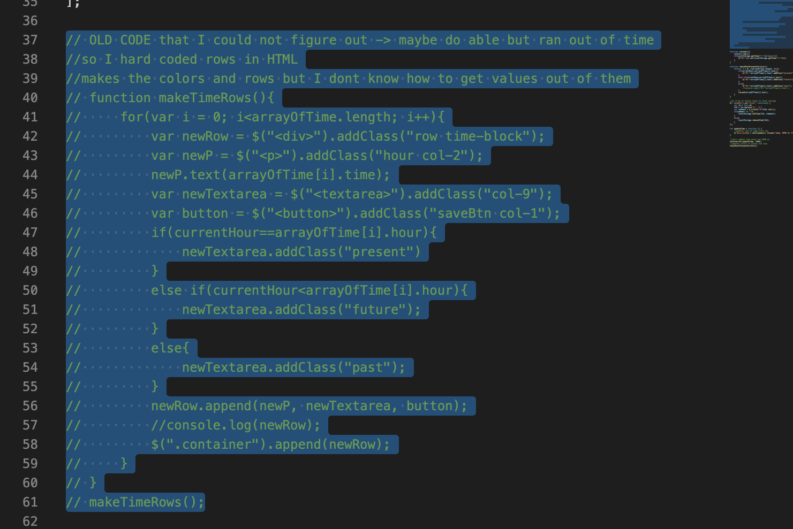

# work_day_scheduler

## Description 

## Table of Contents 

* [Installation](#installation)
* [Usage](#usage)
* [Credits](#credits)
* [Badges](#badges)

## Installation

The installation for this project is to go my github repositories then navigate to Code_Refractor or click this link [Work Day Scheduler](https://github.com/hondahelix/work_day_scheduler) then click on the green code button in the top right. Then you can copy the code via ssh or by downloading a zip file.

## Usage 

                        Dynamic time

                        Local Storage

                    Problem Child

## Credits
Third party assets and instruction was provided by the University of California, Berkeley Full Stack Coding Bootcamp program. As well as utalizing the Monments.js API, Jquery and resources from Bootstrap.

[UCB Coding Bootcamp](https://bootcamp.berkeley.edu/coding/)

[Bootstrap](https://getbootstrap.com/)

[JQuery](https://jquery.com)

[Moments.js](https://momentjs.com/)

---

## Badges

